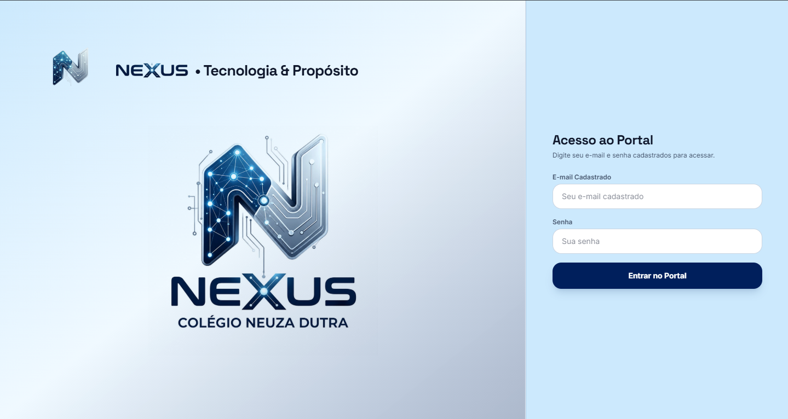
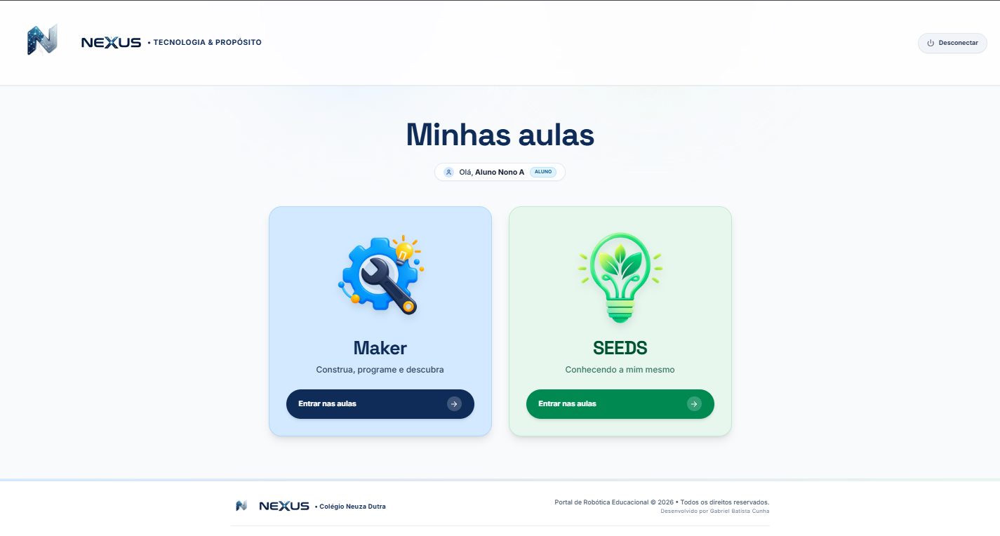
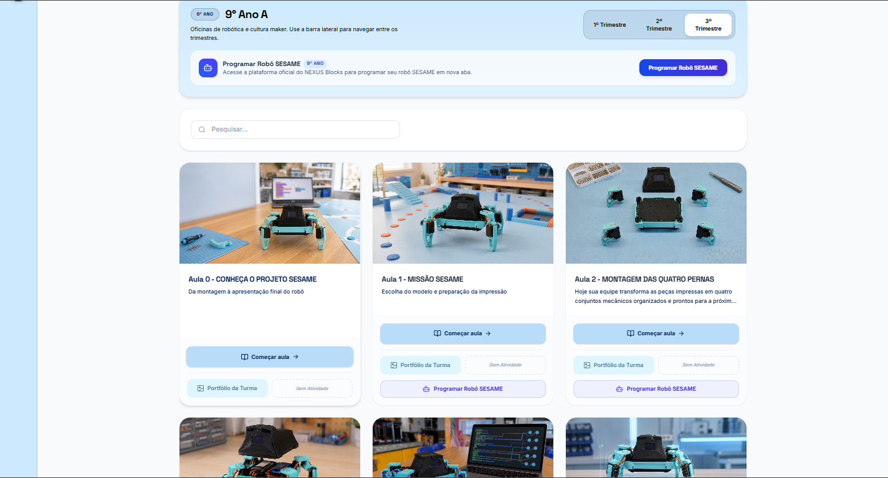
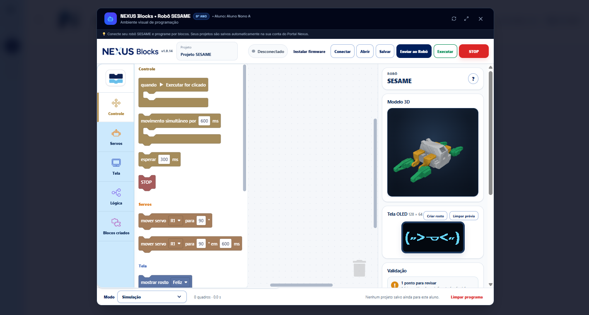
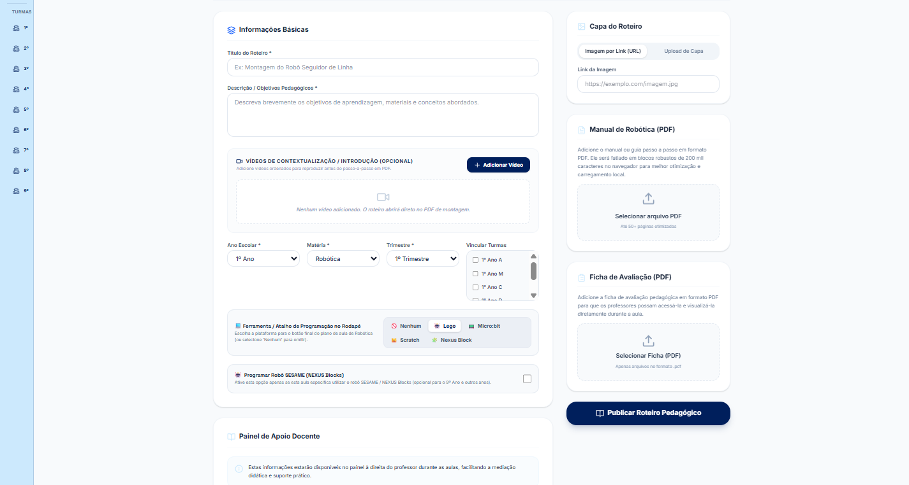
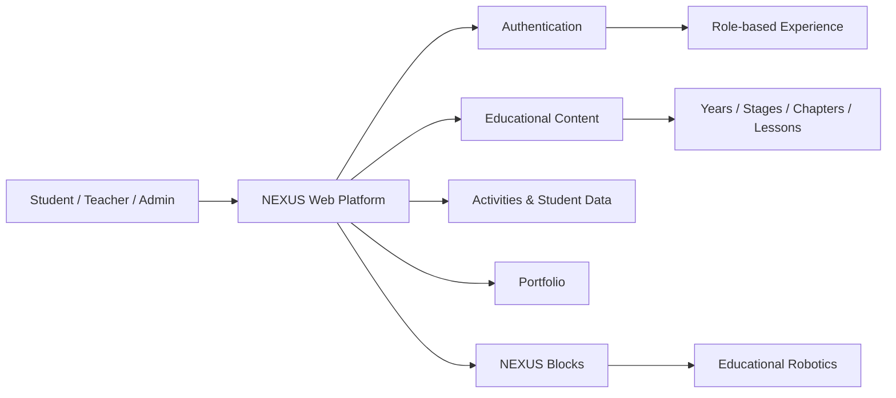

# NEXUS

### Educational Digital Platform for Colégio Neuza Dutra

NEXUS is an educational digital platform designed and developed for **Colégio Neuza Dutra**, a school in Betim, Minas Gerais, Brazil.

The project was created to provide students and teachers with a centralized environment for digital learning experiences, educational content and interactive activities, with dedicated access according to each user's role.

> **Public showcase repository:** the production source code is kept private because the platform is used in a real school environment. This repository documents the project, my role, the product decisions and its technical structure without exposing credentials, internal data or sensitive configuration.

---

## About the project

NEXUS was developed to support technology-focused educational experiences at Colégio Neuza Dutra, including content related to **Robotics, Maker Education and SEEDS**.

The platform organizes learning content by school year, stages, chapters and lessons, while providing different experiences for students, teachers and administrators.

### Main goals

- Centralize digital educational content
- Provide secure, role-based access
- Organize lessons and activities by class and school year
- Allow students to complete and save activities
- Support teachers in following learning experiences
- Integrate interactive educational tools
- Create a scalable digital environment for new school projects

---

## My role

I worked on the project from conception to deployment, including:

- Product conception and feature planning
- User experience and interface decisions
- Development and implementation
- Authentication and user-role flows
- Data persistence and content organization
- Testing and troubleshooting
- Deployment and continuous improvement
- Integration of external educational experiences

The project gave me practical experience turning real educational needs into a working digital product.

---

## Key features

### Role-based experience

NEXUS provides dedicated experiences for:

- **Students**
- **Teachers**
- **Administrators**

Each role receives access to the tools and information relevant to its use of the platform.

### Structured learning content

Educational content can be organized through:

**School Year → Stage → Chapter → Lesson**

This structure makes it possible to expand the platform while keeping content easy to navigate.

### Student activities

Students can interact with activities and have their progress associated with their own authenticated account.

### Educational portfolio

The platform supports student work and learning records in a structured digital environment.

### NEXUS Blocks integration

NEXUS also integrates with **NEXUS Blocks**, a block-based programming environment created for robotics activities involving the SESAME educational robot.

The integration allows students to access the programming experience from within the NEXUS ecosystem while preserving their authenticated context.
## Platform preview

### Secure access
NEXUS starts with an authenticated access flow designed for the school environment.

### Student learning hub
After authentication, students access the learning areas available for their profile, including Maker and SEEDS.

### Structured lesson experience
Lessons are organized by school year and term, with direct access to content, class portfolios and integrated tools.

### Integrated robotics programming
NEXUS integrates **NEXUS Blocks**, a block-based programming environment for the SESAME educational robot, including a 3D simulation, servo controls and OLED face previews.

### Teacher and administrator authoring
Authorized users can create and publish structured educational content, link classes, upload resources and configure robotics-related experiences.

---

## Technologies and concepts

The project involves concepts and technologies such as:

- Web development
- Firebase Authentication
- Cloud data persistence
- Role-based access
- Responsive user interfaces
- Vercel deployment
- Embedded application integration
- Educational technology
- User-centered product design

> Specific production credentials, database rules, internal identifiers and private infrastructure details are intentionally not published.

---

## High-level architecture

A more detailed, non-sensitive overview is available in [`docs/ARCHITECTURE.md`](docs/ARCHITECTURE.md).

---

## Project links

**Live platform:**  
https://nexuscnd.com.br

**Institution:**  
Colégio Neuza Dutra — Betim, Minas Gerais, Brazil

---

## What I learned

NEXUS has been especially valuable for developing skills beyond programming.

Through the project, I improved my ability to:

- Translate user needs into product requirements
- Design workflows for different types of users
- Debug problems in a real production environment
- Iterate based on feedback
- Work with authentication and persistent user data
- Integrate independent systems into one experience
- Make technical decisions while considering usability

---

## Screenshots

Screenshots of the public-facing and non-sensitive areas of the platform can be added to the [`assets`](assets/) folder.

> Student information, internal administrative screens and any personal data should never be included in this public repository.

---

## Status

**Active / continuously improved**

NEXUS continues to evolve according to the educational needs of Colégio Neuza Dutra.

---

## Author

**Gabriel Batista Cunha**  
Information Systems Student · Web Development · Educational Technology

- GitHub: [@Gabirubaa](https://github.com/Gabirubaa)
- NEXUS: https://nexuscnd.com.br
- Email: gabrielbatista.cunha2006@gmail.com

---

### Privacy notice

This repository is a **portfolio and case-study repository only**. It does not contain the private production source code, credentials, student data or confidential information belonging to Colégio Neuza Dutra.
