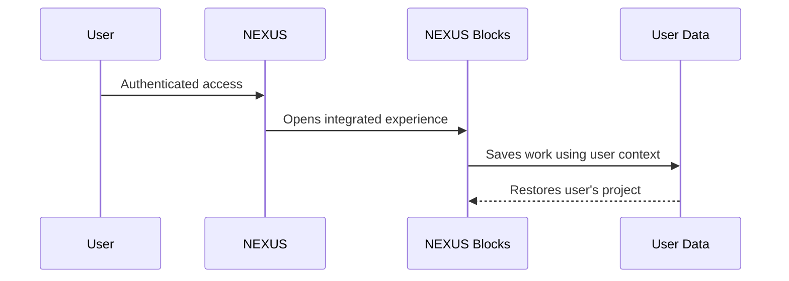

# Architecture Overview

This document provides a high-level overview of NEXUS without exposing private implementation details.

## Product structure

NEXUS is organized around three main user profiles:

1. **Student**
2. **Teacher**
3. **Administrator**

Authentication determines the user context and enables the appropriate experience.

## Learning structure

Educational content follows a scalable hierarchy:

```text
School Year
└── Stage
    └── Chapter
        └── Lesson
            └── Activities / Resources
```

This structure allows the platform to support multiple school years and different educational programs while maintaining consistent navigation.

## Authentication and user context

NEXUS uses authenticated user sessions so that experiences such as activities and saved work can be associated with the correct user.

Role-based access separates student, teacher and administrative experiences.

## Data

Cloud persistence is used for educational content and user-generated learning data.

The public repository intentionally does not document:

- Production database paths
- Security rules
- API keys
- Internal user identifiers
- Administrative data
- Student records

## NEXUS Blocks

NEXUS Blocks is an integrated educational programming environment designed for robotics activities.

At a high level:



The objective is to create a seamless educational experience without requiring the student to manage separate identities across tools.

## Deployment

The web platform is deployed using modern cloud hosting infrastructure, allowing rapid updates and continuous improvements.

## Design principle

The architecture prioritizes:

- Simplicity for students
- Clear teacher workflows
- Separation of user permissions
- Expandable educational content
- Safe handling of school information
- Integration between independent educational tools
